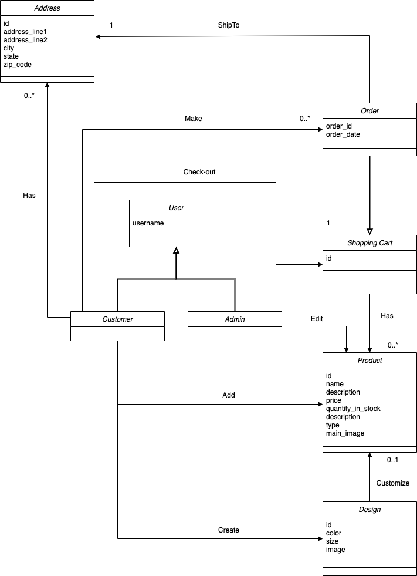
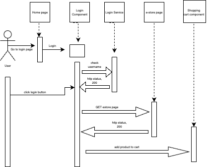
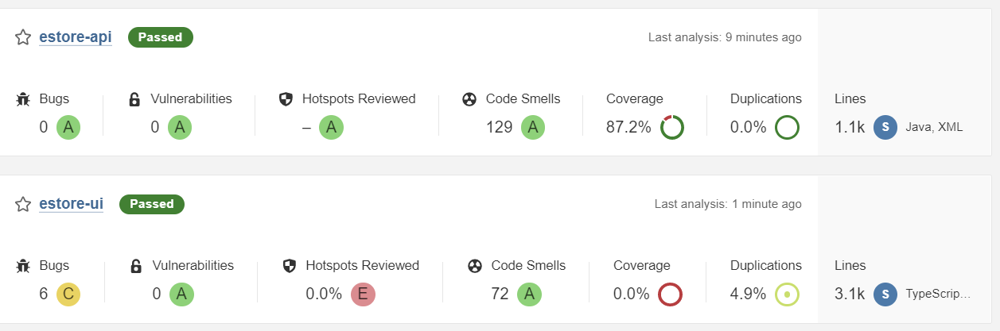
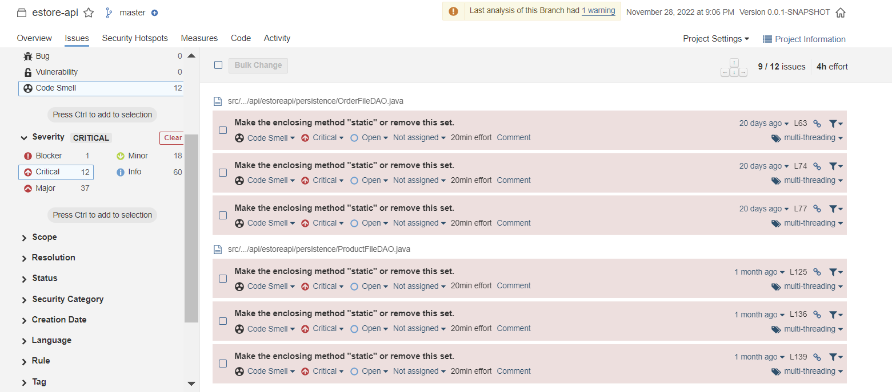
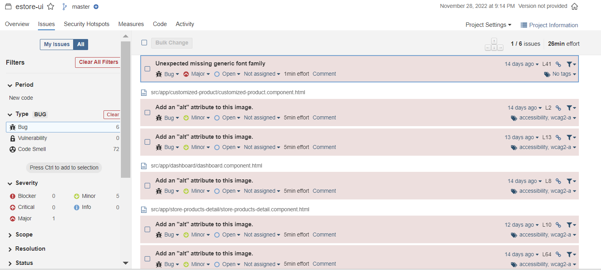
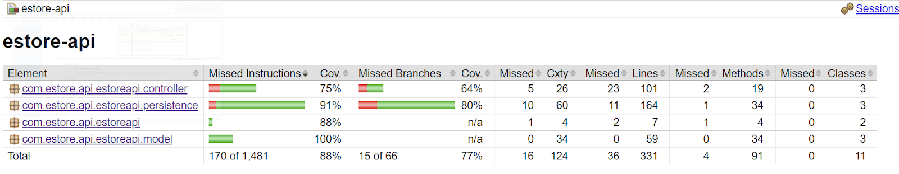
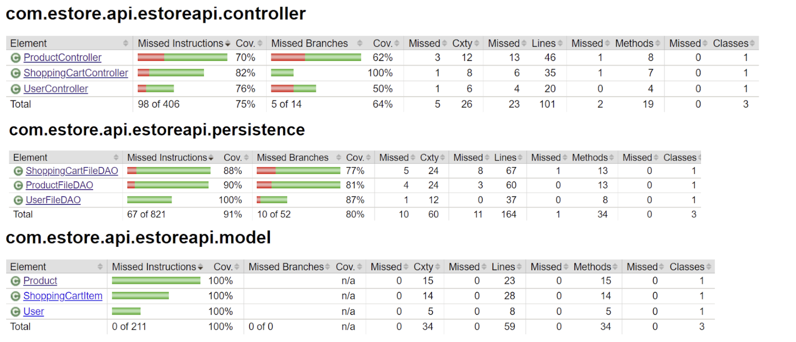

# PROJECT Design Documentation

## Team Information
* Team name: swen-610-01-e-team5
* Team members
  * Caluã de Lacerda Pataca
  * Dipkamal Bhusal
  * Avinash Amudala
  * Md Tanvirul Alam
  * Galekwan Sango

## Executive Summary

This is be an e-store specializing in products that help its buyers express their personalities through its products. As such, the store will offer t-shirts, beyond their practical uses, can serve as a canvas for users to express their tastes and ideas.

### Purpose
* Online store for customizable personal products
* Express personalities through products. 
* T-shirts with custom designs
* Customers can select from a range of provided designs or upload their own

### Glossary and Acronyms
> _Provide a table of terms and acronyms._

| Term | Definition |
|------|------------|
| SPA | Single Page |

## Requirements

### Definition of MVP
> User should be able to login and add products to their shopping cart and admin should be able to maintain product repository.

### MVP Features
* As a Customer, I want to use my username to log in to the e-store so that I can access its customer-facing services.
* As an Admin, I want to use my admin username to log in to the e-store so that I can access its admin-facing services. 
* As a Customer, I want to be able to add a product to my shopping cart, so that I can later purchase it.
* As an Admin, I want to be able to edit a product’s records, so that customers can see up-to-date information about the products that I have on offer.
* As a Customer, I want to be able to remove a product from my shopping cart, so that I no longer have to buy it when I check out my order.
* As a Customer, I want to be able to leave the site and not lose products in my shopping cart when I log back in so that I can decide on whether or not I want to buy a product at my own convenience. 

### Roadmap of Enhancements
* As a Customer, I want to be able to customize a product with designs provided by the shop or myself so that it reflects my personal tastes. 
* As a Customer, I want to be able to choose a product’s size and colors so that they match my unique needs and tastes. 

## Application Domain

This section describes the application domain.

## Architecture and Design

This section describes the application architecture.

### Summary

The following Tiers/Layers model shows a high-level view of the webapp's architecture.

The e-store web application, is built using the Model–View–ViewModel (MVVM) architecture pattern. 

The Model stores the application data objects including any functionality to provide persistance. 

The View is the client-side SPA built with Angular utilizing HTML, CSS and TypeScript. The ViewModel provides RESTful APIs to the client (View) as well as any logic required to manipulate the data objects from the Model.

Both the ViewModel and Model are built using Java and Spring Framework. Details of the components within these tiers are supplied below.

### Overview of User Interface

The user logs into the e-store using their username. On the home page, they can search for products and add it to their shopping cart. They can modify their card by removing items from the cart if they change their mind. If they log out, the estore will store their cart information when they log back in. Once ready, the user can proceed to checkout. 

### View Tier
* User will 

* User will login using a loginpage which is the default home page. 
* Once the user enter his username, it will communicate with rest api controller and authenticate the user if it exists. 
* Once the user is authenticated, he will use the product page to add product to shopping cart. The home page of cart has search options for product, buttons for adding product to cart.

### ViewModel Tier
* REST api bridges between client and model.
* It handles all communication from client side with the local server. 
* It communicates user login information, and products search/add with the model. 
* It provides the appropriate data if the communication validates; else, throws an exception. 

### Model Tier
* Product: This model represents the product entity with declarations for creating a product with given id, name, price and quantity; retrieving product id, setting the name of the product, retrieving the price of the product, setting the price of the product, retrieving the quantity of the product, and setting the product quantity.   
* User: This model represents the user entity with declarations for creating a unique user with given id and name; retrieving an id of the user, setting hte name of the user, and retrieving the name of the user. 
* Shopping cart item: This model represents each item in the shopping cart with declarations for getting and setting shopping card id; getting and setting shopping cart quantity and getting user id. We need to set shopping cart id separately so that we can track the number of quantities of each product added to the cart.

### Static Code Analysis/Design Improvements

<!-- 25,27,29 -->

<!-- * 
> _Discuss design improvements that you would make if the project were
> to continue. These improvement should be based on your direct
> analysis of where there are problems in the code base which could be
> addressed with design changes, and describe those suggested design
> improvements._

> _With the results from the Static Code Analysis exercise, 
> discuss the resulting issues/metrics measurements along with your analysis
> and recommendations for further improvements. Where relevant, include 
> screenshots from the tool and/or corresponding source code that was flagged._ -->
We have screenshots for static code analysis. We passed acceptance criteria for both API and UI. For API, we had no code duplication (0%); for UI the number was 4.9%. We had some warning/code smells for both API and UI implementation. Some examples from the API are not having method defined as static when it should have been or having unused variables. There were some bugs in the UI but these were caused by omitting "alt" attributes for images.

## Testing

### Acceptance Testing
We tested the MVP functionalities and the 10% features based on our acceptance criteria. We passed the test cases at the end of Sptrint 3.

### Unit Testing and Code Coverage

<!-- 23, 24 -->

<!-- > _Discuss your unit testing strategy. Report on the code coverage
> achieved from unit testing of the code base. Discuss the team's
> coverage targets, why you selected those values, and how well your
> code coverage met your targets. If there are any anomalies, discuss
> those._ -->
We achieved 88% instruction level and 77% branch level code coverage for the API. Our goal was 90% instruction level coverage, so we were pretty close to the target. We achieved 100% coverage for the Model tier but it was 75% for Controller tier. This is because we failed to test all the failure cases properly for the Controller classes. We have added tier specific code coverage result in the screenshots.
